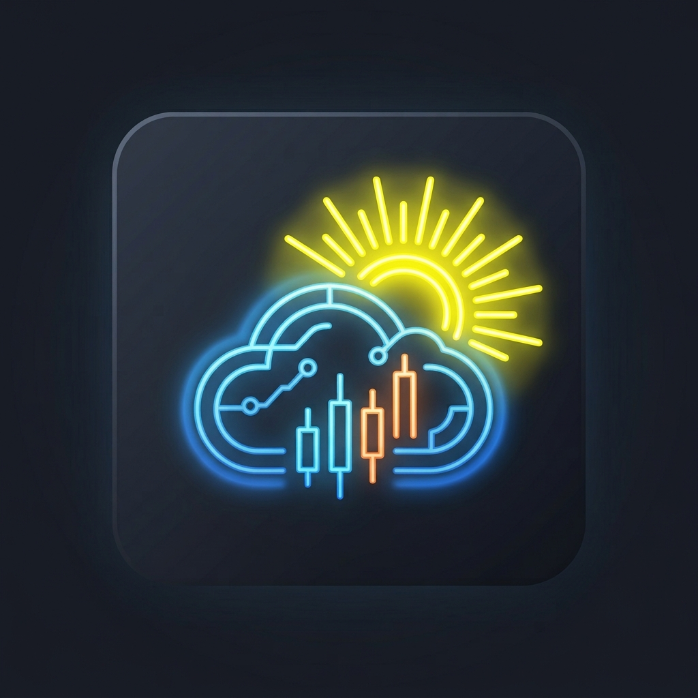

# 🌤️ Weather In Ukraine (Порівняльний аналіз клімату України)

## Ще наші проєкти
**[UAFilter](https://antiruskontrol.github.io/antirus-control/)** Розширення для броузеру яке блюрить руснячий текст на всіх сайтах, та скіпає русняче відео на YouTube Shorts

[🇺🇦 Українська версія](#-українська-версія) | [🇬🇧 English Version](#-english-version)

---

## 🇺🇦 Українська версія

**Weather In Ukraine** — це інтерактивний вебдодаток з відкритим вихідним кодом для моніторингу, порівняння та візуалізації кліматичних даних міст України. Проєкт створено для зручного аналізу температурних змін за різні роки.

🔗 [((https://antiruskontrol.github.io/WeaherinUkraine/))](https://antiruskontrol.github.io/WeatherInUkraine/)

📧 **Зворотний зв'язок / Контакти:** [напишіть мені листа](mailto:antiruskontrol@ukr.net)

### 🎨 Логотип проєкту

### ✨ Особливості проєкту
* 📊 **Інтерактивні графіки:** Візуалізація максимальної, мінімальної та середньої температури.
* 🏙️ **Масштабне покриття:** Зручне меню міст, розбитих за областями України.
* 📅 **Порівняння років:** Можливість одночасно виводити графіки за різні роки (від 2018 до 2026).
* 🔍 **Гнучке керування:** Масштабування колесом миші, перетягування та точні підказки при наведенні.
* 🌙 **Сучасний інтерфейс:** Комфортна темна тема (Dark Mode).

### 🛠️ Технологічний стек
* HTML5 / CSS3 (Grid & Flexbox)
* Pure JavaScript (ES6+ Asynchronous Fetch)
* Інтеграція з API погоди (Open-Meteo)

📧 **Зворотний зв'язок / Контакти:** [напишіть мені листа](mailto:antiruskontrol@ukr.net)

---

## 🇬🇧 English Version

**Weather In Ukraine** is an interactive web application designed for monitoring, comparing, and visualizing historical climate and weather data across various Ukrainian cities. 

🎬 **Live Project Demo:** [Watch Application Demo Video (demo.mp4)](demo.mp4)

### ✨ Key Features
* 📊 **Interactive Charts:** High-performance linear charts visualizing temperature trends.
* 🏙️ **Comprehensive Coverage:** Comprehensive dropdown selector grouping Ukrainian cities by region.
* 📅 **Multi-Year Comparison:** Overlay and analyze climate data simultaneously for different periods.
* 🔍 **Advanced UI Controls:** Mouse-wheel zooming, click-and-drag panning, and precise data tooltips.
* 🌙 **Modern Dark Mode:** Sleek, high-contrast user interface tailored for comfortable data analysis.

### 🛠️ Tech Stack
* HTML5, CSS3 (Modern Grid & Flexbox layouts)
* Pure JavaScript (ES6+)
* Integration with open climate endpoints (Open-Meteo API)

## 📄 License
This project is open-source and available under the [MIT License](LICENSE).

🔗 [((https://antiruskontrol.github.io/WeaherinUkraine/))](https://antiruskontrol.github.io/WeatherInUkraine/)

📧 **Contact Email:** [send an email to developer](mailto:antiruskontrol@ukr.net)

